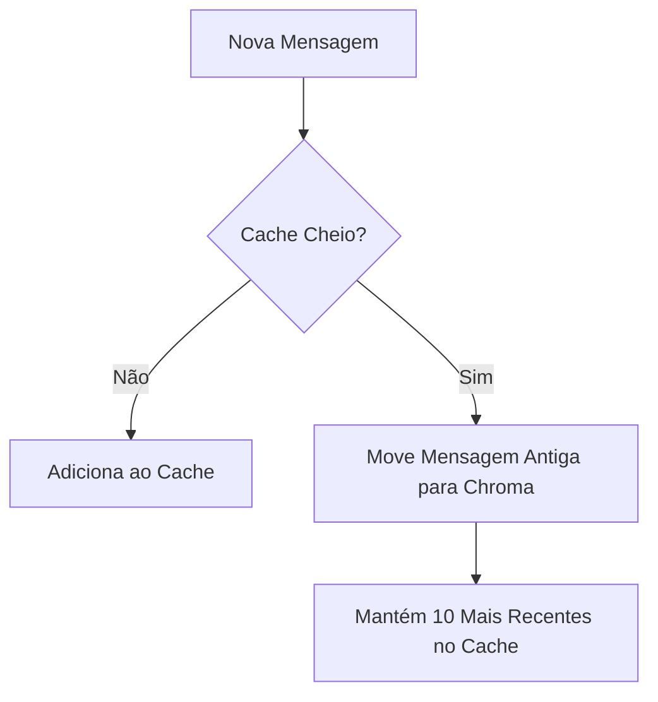
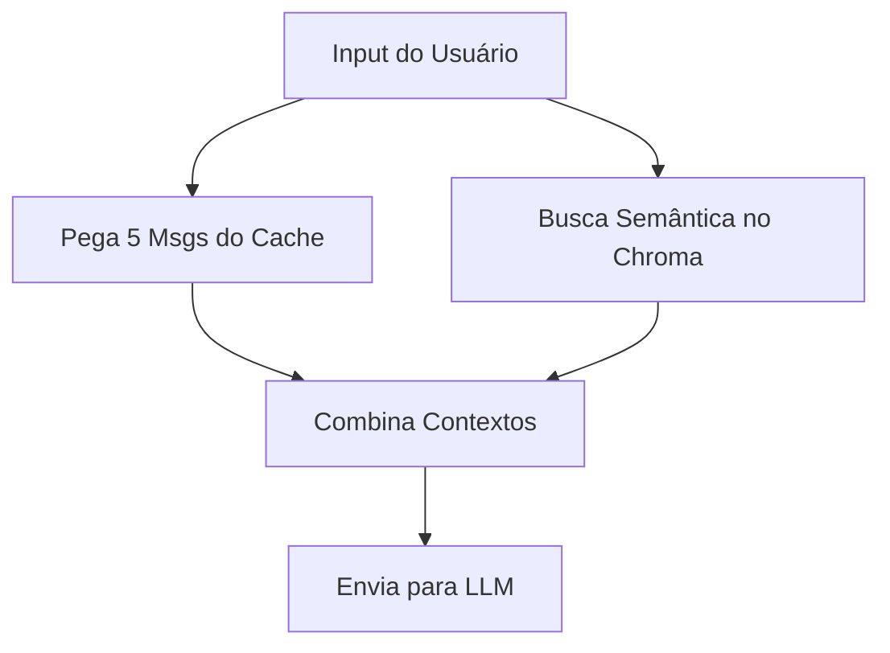

# Sistema de Memória do Chat IA Terminal

## Visão Geral

O Chat IA Terminal implementa um sistema de memória em três camadas que permite manter um histórico "infinito" de conversas sem comprometer a performance.

```
┌─────────────────┐
│  Cache (RAM)    │ → Últimas 10 mensagens
├─────────────────┤
│  Vector Store   │ → Histórico completo indexado
├─────────────────┤
│  LLM (Groq)     │ → Processamento de novas entradas
└─────────────────┘
```

## Componentes

### 1. Cache em Memória (MessageCache)

- **Localização**: `assistant.py`
- **Capacidade**: 10 mensagens mais recentes
- **Tipo de Storage**: RAM (memória volátil)
- **Velocidade**: Ultra-rápida
- **Propósito**: Manter contexto imediato da conversa

```python
class MessageCache:
    def __init__(self, max_size=10):
        self.messages = []
        self.max_size = max_size
        self.vector_memory = VectorMemory(CHROMA_DIR)
```

### 2. Vector Store (ChromaDB)

- **Localização**: `memory/vector_store.py`
- **Capacidade**: Ilimitada
- **Tipo de Storage**: Disco (persistente)
- **Velocidade**: Rápida para buscas semânticas
- **Propósito**: Armazenar histórico completo com busca inteligente

```python
class VectorMemory:
    def __init__(self, persist_directory="./chroma_db"):
        self.client = chromadb.Client(...)
        self.collection = self.client.get_or_create_collection(
            name="chat_memory",
            metadata={"hnsw:space": "cosine"}
        )
```

## Fluxo de Dados

### 1. Adição de Mensagens



**Código Relevante**:
```python
def add(self, role, content):
    self.messages.append((role, content))
    if len(self.messages) > self.max_size:
        to_archive = self.messages[:-self.max_size]
        self.messages = self.messages[-self.max_size:]
        self.vector_memory.archive_messages(to_archive)
```

### 2. Recuperação de Contexto



**Código Relevante**:
```python
def get_chat_context(user_input):
    recent = get_conversation_context(max_messages=5)
    historical = message_cache.search_context(user_input)
    
    if historical:
        context = f"""
        Contexto histórico relevante:
        {historical}
        
        Conversa atual:
        {recent}
        """
    return context
```

## Exemplo de Funcionamento

### Estado Inicial (10 mensagens)
```
Cache: [msg1, msg2, msg3, msg4, msg5, msg6, msg7, msg8, msg9, msg10]
Chroma: []
```

### Após 11ª mensagem
```
Cache: [msg2, msg3, msg4, msg5, msg6, msg7, msg8, msg9, msg10, msg11]
Chroma: [msg1]
```

### Após 12ª mensagem
```
Cache: [msg3, msg4, msg5, msg6, msg7, msg8, msg9, msg10, msg11, msg12]
Chroma: [msg1, msg2]
```

## Benefícios

1. **Performance Otimizada**
   - Cache rápido para contexto recente
   - Arquivamento automático de mensagens antigas
   - Busca semântica eficiente no histórico

2. **Memória Persistente**
   - Histórico completo preservado
   - Recuperação inteligente por relevância
   - Não perde contexto importante

3. **Uso Eficiente de Recursos**
   - Memória RAM limitada (max 10 mensagens)
   - Armazenamento em disco otimizado
   - Indexação vetorial para busca rápida

## Configuração

1. **Cache**
   ```python
   message_cache = MessageCache(max_size=10)  # Ajuste conforme necessário
   ```

2. **Chroma**
   ```python
   CHROMA_DIR = os.path.join(os.path.dirname(os.path.abspath(__file__)), 'chroma_db')
   vector_memory = VectorMemory(CHROMA_DIR)
   ```

## Manutenção

1. **Backup**
   - O diretório `chroma_db` contém todo o histórico
   - Faça backup regularmente
   - Mantenha em local seguro

2. **Limpeza**
   ```python
   message_cache.clear()  # Limpa cache e Chroma
   ```

3. **Monitoramento**
   - Verifique o tamanho do diretório `chroma_db`
   - Monitore uso de RAM do cache
   - Observe tempos de resposta

## Troubleshooting

1. **Cache Lento**
   - Reduza `max_size`
   - Verifique uso de memória
   - Limpe cache se necessário

2. **Chroma Lento**
   - Verifique tamanho do índice
   - Otimize consultas
   - Considere limpeza periódica

3. **Problemas de Contexto**
   - Ajuste número de mensagens no cache
   - Verifique qualidade das embeddings
   - Otimize prompt de busca
